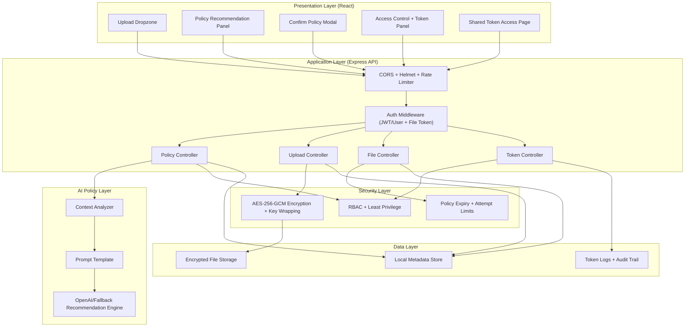

# AI-Assisted Secure Access Policy Management System

Production-grade full-stack application that reduces security misconfiguration from human error by requiring AI-assisted policy recommendation plus explicit human approval before storage or sharing.

## Scope Constraints
- AI is used only for access policy recommendation and risk explanation.
- AI does not perform attack detection, intrusion detection, threat hunting, or ML training.
- AI never receives plaintext file content.
- Files are encrypted before persistence.

## Tech Stack
- Frontend: React (functional components), TailwindCSS, responsive layout, bold dark premium theme.
- Backend: Node.js, Express, REST APIs, middleware-first security design.
- Data: Local encrypted file storage + local metadata datastore (`backend/storage/local-db.json`).
- AI Integration: OpenAI-compatible prompt-based recommendation engine.
- Security: Helmet, CORS, rate limiting, JWT auth, file JWTs, AES-256-GCM encryption, audit logs.

## Layered Architecture
1. Presentation Layer: React dashboard, approval modal, token-based file access page.
2. Application Layer: Express routes/controllers for policy, upload, file, and token flows.
3. Security Layer: RBAC, auth middleware, least-privilege checks, time-based expiry, encryption services.
4. AI Policy Layer: metadata context analysis, recommendation generation, risk explanation generation.
5. Data Layer: encrypted file blobs + encrypted metadata + token/audit logs.



Diagram source: `docs/architecture.mmd`.

## Implemented Features

### 1. File Upload Module
- Drag-and-drop upload UI.
- File size validation (frontend and backend).
- MIME type + signature detection.
- No plaintext persistence.

### 2. AI Policy Engine
- Context analysis from `dataType`, `purpose`, `sensitivity`, `duration`, file metadata.
- Hybrid recommendation output (deterministic risk baseline + AI narrative):
  - `permissionLevel`
  - `expiryHours`
  - `encryptionRequired`
  - `maxAccessAttempts`
  - `riskScore`
  - `riskLevel`
  - `riskSignals`
  - `riskExplanation`
  - `decisionSummary`
  - `reviewChecklist` (3 reviewer actions)
  - `uploadModuleRecommendations` (3 concrete hardening actions)
- Guardrails prevent AI from loosening baseline controls (permission/expiry/attempt caps).
- Human-in-the-loop approval required before enforcement.

### 3. Security Enforcement Layer
- RBAC (`admin`, `editor`, `viewer`).
- Time-based policy expiry checks.
- Max-attempt enforcement.
- Least-privilege restrictions on approval overrides.

### 4. Encryption Module
- AES-256-GCM encryption before storage.
- Per-file key wrapping.
- Encrypted metadata at rest.

### 5. Access Control + Token Management
- Policy-driven `view` / `edit` permissions.
- Permission lock: generated file token permission must match approved file policy.
- JWT file tokens with expiry and max-usage limits.
- Optional token secret password (salted + hashed, never stored plaintext).
- Token validation endpoint for dashboard and shared-link flow.
- Friendly share reference support (`tokenId:shareCode`) so recipients do not need full JWT.
- Strict access behavior:
  - `view` token: preview-only
  - `edit` token: download-only

### 6. Secure Storage + Logging
- Encrypted file blobs only.
- Policy and token metadata in local datastore.
- Access logs, token logs, and audit trail with sensitive field redaction.

## API Endpoints
- `POST /upload`
- `POST /generate-policy`
- `POST /approve-policy`
- `GET /files`
- `GET /file/:id`
- `DELETE /file/:id`
- `POST /generate-token`
- `POST /validate-token`
- `POST /validate-file-token` (shared-token validation for top JWT input/new page flow)
- `POST /resolve-share-access` (resolve `shareId + shareCode` into short-lived file-access JWT)
- `POST /auth/register` (create local user account and issue session JWT)
- `POST /auth/login` (local user login; falls back to bootstrap admin credentials if configured)
- `GET /auth/dev-token` (development convenience)
- `GET /auth/me` (resolve authenticated user profile from session JWT)

## Project Structure
```text
.
├── README.md
├── render.yaml
├── docs
│   └── architecture.mmd
├── backend
│   ├── .env.example
│   ├── package.json
│   ├── scripts
│   │   └── issueDemoToken.js
│   ├── logs
│   ├── storage
│   │   ├── encrypted
│   │   └── local-db.json
│   └── src
│       ├── app.js
│       ├── server.js
│       ├── config
│       ├── constants
│       ├── controllers
│       ├── data
│       ├── middleware
│       ├── models
│       ├── routes
│       ├── services
│       │   ├── ai
│       │   ├── security
│       │   └── storage
│       ├── utils
│       └── validators
└── frontend
    ├── .env.example
    ├── package.json
    ├── vercel.json
    └── src
        ├── App.jsx
        ├── api/client.js
        ├── components
        │   ├── AccessControlPanel.jsx
        │   ├── EncryptedFileList.jsx
        │   ├── FilePreviewModal.jsx
        │   ├── PolicyApprovalModal.jsx
        │   ├── PolicyRecommendationPanel.jsx
        │   ├── SharedTokenAccessPage.jsx
        │   ├── TokenStatusView.jsx
        │   └── UploadDropzone.jsx
```

## Environment Setup

### Backend env (`backend/.env`)
Copy from `backend/.env.example` and set:
- `ACCESS_JWT_SECRET`
- `FILE_TOKEN_SECRET`
- `MASTER_ENCRYPTION_KEY` (64 hex chars recommended)
- `OPENAI_API_KEY` (optional; fallback recommendation engine works without it)
- `BOOTSTRAP_LOGIN_EMAIL`
- `BOOTSTRAP_LOGIN_PASSWORD`
- `BOOTSTRAP_LOGIN_ROLE` (`admin` | `editor` | `viewer`)
- `ENABLE_DEV_AUTH_ENDPOINT` (`true` for local dev convenience, `false` for production)

### Frontend env (`frontend/.env`)
Copy from `frontend/.env.example`:
- `VITE_API_BASE_URL=http://localhost:5050`
- `VITE_DEFAULT_AUTH_TOKEN=` (optional)
- `VITE_ENABLE_DEV_AUTH=true` (set `false` in production)
- `VITE_BOOTSTRAP_LOGIN_EMAIL=admin@secure-policy.local`

## Run Locally

1. Install dependencies
```bash
cd /Users/vabhiram/Documents/infoseq/backend && npm install
cd /Users/vabhiram/Documents/infoseq/frontend && npm install
```

2. Start backend
```bash
cd /Users/vabhiram/Documents/infoseq/backend
npm run dev
```

3. Start frontend
```bash
cd /Users/vabhiram/Documents/infoseq/frontend
npm run dev
```

4. Open UI
- Frontend: `http://localhost:5173`
- Backend: `http://localhost:5050`

## Deployment (Production-Ready)

### Recommended: Full-Stack Render Blueprint (already configured)

This repository includes `/Users/vabhiram/Documents/infoseq/render.yaml` for one Blueprint deployment of:
- `secure-policy-api` (Node web service)
- `secure-policy-app` (static frontend service)
- Free-tier compatible configuration (no persistent disk mount)

How to deploy on Render:
1. Push this repository to GitHub/GitLab.
2. In Render dashboard, choose **New +** -> **Blueprint**.
3. Select this repo and keep `render.yaml` path default.
4. Click apply.

Notes:
- `OPENAI_API_KEY` is optional (fallback policy engine works without it).
- `render.yaml` is hardened for deployment:
  - backend `CORS_ORIGIN` is bound to frontend `RENDER_EXTERNAL_URL`
  - frontend static publish path is `dist`
  - dev-token auto-login is disabled (`ENABLE_DEV_AUTH_ENDPOINT=false`, `VITE_ENABLE_DEV_AUTH=false`)
  - bootstrap login credentials are expected via `BOOTSTRAP_LOGIN_*` env vars
- Free-tier limitation: backend storage is ephemeral, so encrypted files/local JSON datastore can reset on restart/redeploy.
- For persistence, move API service to a paid Render plan with disk support or migrate storage to managed external services.

### Alternative: Frontend on Vercel + Backend on Render

- `/Users/vabhiram/Documents/infoseq/frontend/vercel.json` is included for SPA rewrites.
- Deploy backend (`backend/`) as Node service on Render.
- Deploy frontend (`frontend/`) on Vercel with:
  - `VITE_API_BASE_URL=https://<your-render-backend-url>`

## End-to-End Usage Flow
1. Obtain Session JWT:
   - local dev: auto-issued via `/auth/dev-token` when `VITE_ENABLE_DEV_AUTH=true`
   - account flow: register via `/auth/register` then sign in via `/auth/login`
   - deployed/prod admin fallback: use bootstrap credentials through `/auth/login` with `BOOTSTRAP_LOGIN_*` env vars
2. Upload file + fill metadata form.
3. Generate policy (`/generate-policy`).
4. Confirm policy (exact AI recommendation or controlled override + approval note).
5. Secure upload (`/upload`) after approval.
6. Select encrypted file and generate token (permission is locked to approved policy).
7. (Optional) Set secret password while generating token.
8. Share either:
   - `Share Link` (recommended), or
   - `Share Ref` (`tokenId:shareCode`), or
   - full JWT token (still supported).
9. Recipient opens top `Access Files (Share)` and pastes the link/ref/token, then clicks `Access Files`.
10. In the new shared access page, click `Unlock & Open File`:
   - If token was password-protected, enter the secret password.
11. Access behavior:
   - `view` token opens in-browser preview.
   - `edit` token downloads the file.

## Validation Completed
- Backend syntax check: `npm run check` passed.
- Frontend production build: `npm run build` passed.

## Remaining Work
- No functional implementation tasks left for local development.
- Deployment configuration is included (`render.yaml`, `frontend/vercel.json`).
- Optional hardening after go-live: replace wildcard CORS with exact frontend origin and move encryption keys to managed secrets/KMS.
